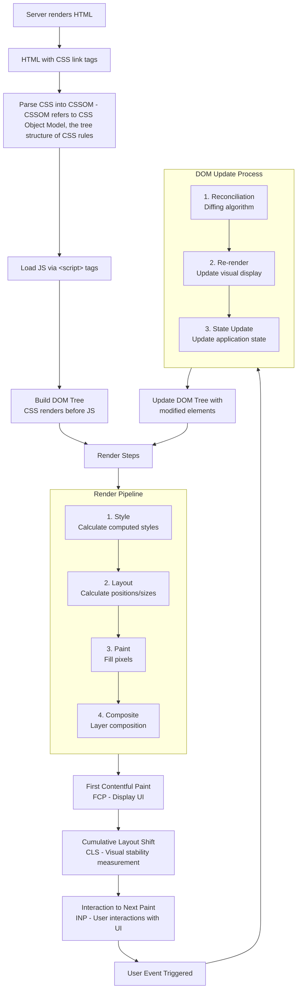
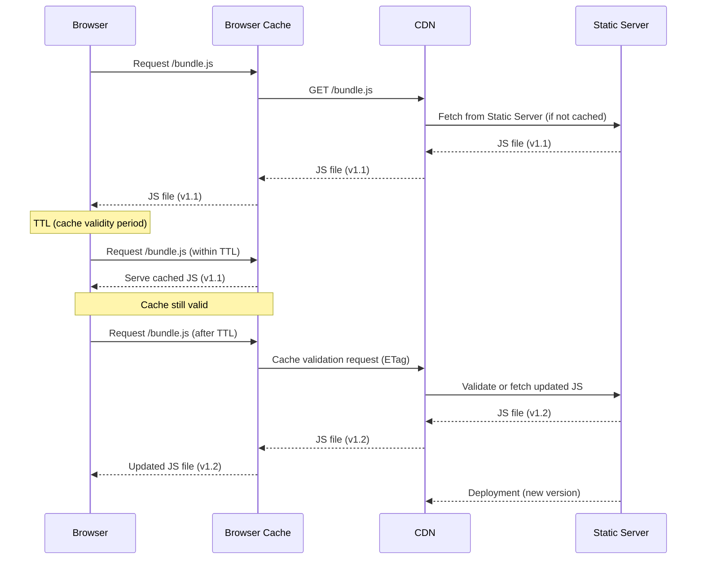
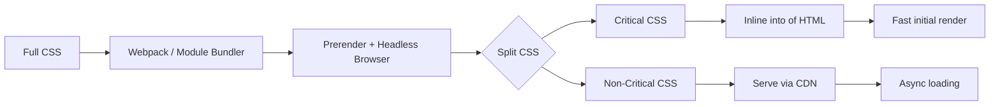
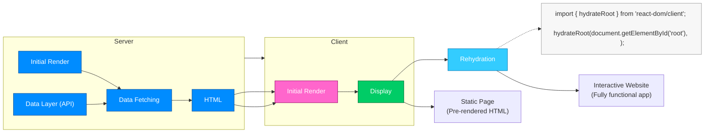
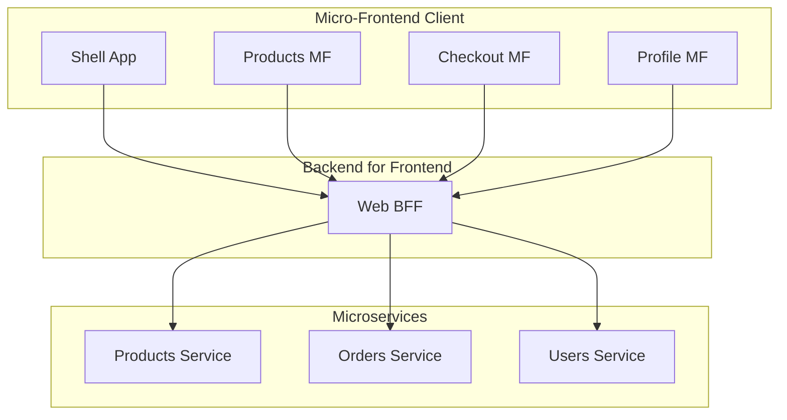

# Some Front-end Knowledge Note

- Some notes might be helpful for front-end development ~

## The Critical Rendering Path - Describe how web page renders

Server -> HTML -> CSS -> CSSOM   -> Render tree -> Render steps -> First content full paint (FCP) [Display UI] ->
               -> JS  -> DOM tree                  (1). Style
               (JS rendered after CSS rendered)    (2). Layout
                                                   (3). Paint
                                                   (4). Composite

After FCP completed, then start with Cumulative layout Shift (CLS) - Measure visual stability of the page -> Interaction to Next Paint (INP) - user started to do some interactions with the web page

Once the user event triggered (INP step), it will cover with 3 steps: -> 
  - Reconciliation
  - Re-render
  - State update

Finally will trigger the browser re-render the new updated DOM element from DOM tree

### Diagram




## Core Web Vitals - Performance focused metrics

- Metrics that measure how fast page loads (CRP) and how fast it responds to input

Metrics are covered (with one descriptive word for each):
  - LCP: Largest Contentful Paint (Loading)
  - INP: Interaction to Next Paint (Interactivity)
  - CLS: Cumulative layout Shift (Visual Stabaility)


## HTTP Caching

- Caching is like a memoization mechnism that reusing same content for a predefined time after first receiving it (TTL: Time To Live -> refers to the time we should consider a cached asset "fresh").

- For API request explnantion, caching stores the response of a request in a cache, and if the same request is made again, the response is retrieved from the cache instead of being re-fetched from the server.



- Most of time we could consider to use `CDN` which will help us to cache the static assets (like JS, CSS, images) for a predefined time (TTL) after first receiving it.


## Content negotiation 🤝

- Client sends request to server and with some specific headers which ask server toi give some specific format of data

Eg: `Accept-Encoding: gzip, deflate, br, zstd`

- Basically, advantage (the reason) is request to download the compressed version and then decompress it and use it rather than download a large file sized content from server side


## Lazy laoding

- Only load the content when needed, eg: when use scrolling, load new contents

Code eexample: dynamic import during run time ~

```js
button.addEventListener("click", async () => {
  const { openModal } = await import("./modal"); // dynamically fetching modal code logics from server side during run time !!!
  openModal({ title: "Hello Modal" });
});
```


## Bundle Splitting

- Traditionally, bundle all files into one file, eg: Webpack module bundler, Rollup, Parcel, etc.

- But with bundle splitting, we could split the bundle into multiple files, eg: one file for each page, one file for each component, etc.

Eventually, going to dynamically render the specific bundle file based on user interaction, eg: page switching render different components


## Critical CSS - Finds CSS used in ``above-the-fold` HTML

- Webpack has few plugins (like `mini-css-extract-plugin`, `optimize-css-assets-webpack-plugin`) to support the Critical CSS separation from the main bundle file

### How it works behind the scenes:

- Loads index.html + bundled CSS using a headless browser (like Puppeteer)
- Renders above-the-fold content (based on viewport height/width)
- Extracts only the CSS rules actually used by visible DOM nodes
- Inlines them or saves as critical.css

### Mermaid Diagram:



### Code example by using `critters-webpack-plugin`:

```js
// webpack.config.js
const MiniCssExtractPlugin = require('mini-css-extract-plugin');
const Critters = require('critters-webpack-plugin');

module.exports = {
  module: {
    rules: [
      {
        test: /\.css$/,
        use: [MiniCssExtractPlugin.loader, 'css-loader'],
      },
    ],
  },
  plugins: [
    new MiniCssExtractPlugin({
      filename: '[name].[contenthash].css',
    }),

    // This plugin automatically:
    // ✅ Finds CSS used in above-the-fold HTML
    // ✅ Inlines it into <style> in <head>
    // ✅ Loads the rest as a non-blocking CSS file
    new Critters({ // Critters analyzes the HTML & finds critical CSS
      preload: 'swap', // add <link rel="preload"> for the rest
      pruneSource: true, // remove inlined CSS from main CSS file
    }),
  ],
};
```

### Why we need Critical CSS? What for?

By inlining just the essential CSS in `<head>` (for visible content only), Critical CS resolves:

- The browser can render the page immediately - Users would see the web content faster
- The rest of CSS can be loaded later on
- Improves the Core Web Vitals metric scores (LCP, FCP, CLS)


## Essential State

- Minimum data representation needed to achieve a given UI
- Separate UI into smaller components and how each component interact with each other


## Reducer pattern

- Like when we chat on state management tools, eg: Zustand, Redux, we always talk about the tools, but how the Interviewer want to listen is: what patterns behind the scenes we are using for handling the stat management? For instance, `Reducer pattern`

- The reason why we need to docus on patterns instead of technologies itself, is because of libs or frameworks normally get invented titme by time, but for the patterns, normally is the underlying fundementals for those libs or frameworks (**<b>we talk about of fundations instead of surfaces during interview</b>**)

- Actions -> Reducer functions (Update old state to new state) -> Re-render (Reconciliation)

```js
// reducer example
function reducer(state, action) {
  switch (action.type) {
    case 'INCREMENT':
      return { ...state, count: state.count + 1 };
    case 'DECREMENT':
      return { ...state, count: state.count - 1 };
    default:
      return state;
  }
}
```

### Why Reducer pattern?

- Keep the state immutable, predictable (deterministic) and no side effects (no mutation of state)


## Windowing

- We could use some techs, eg: virtualised list to control numbe rof items rendering at one time, we could divide the limited number of DOM elmeents as one `Window` and then we can avoid too much elements rendering at same time causing page crash issue ~

- Common techs: `react-virtualized`, `@vueuse/core` (`useVirtualList`) and etc (**Under the hood, its using `IntersectionObserver` API allows us to observe when an element enters or exits the viewport**).


## Server Side Rendering

- Server Side Rendering (SSR) is a technique that allows us to render the web page on the server side, and then send the rendered HTML to the client side

- We could use SSR to improve the performance of our web application, and also to improve the SEO of our web application

- MDN [reference link](https://developer.mozilla.org/en-US/docs/Glossary/Server-side_rendering)

### There is one issue might be facing for server side rendering, which is White Screen Of Death (`WSOD`)

- The reason why we get WSOD is because the server side rendering process is synchronous, and the browser will wait for the server to respond before rendering the page

- To solve this issue, we have few methods can counting on:

1. Simple React + Express example:

```js
app.get('*', async (req, res) => {
  try {
    const context = {};
    const html = renderToString(
      <ServerProvider>
        <StaticRouter location={req.url} context={context}>
          <App />
        </StaticRouter>
      </ServerProvider>
    );
    
    if (context.url) {
      // Redirect
      res.redirect(301, context.url);
    } else {
      res.send(`
        <!DOCTYPE html>
        <html>
          <head><title>App</title></head>
          <body>
            <div id="root">${html}</div>
            <script src="/client.js"></script>
          </body>
        </html>
      `);
    }
  } catch (error) {
    console.error('SSR Error:', error);
    // Fallback to client-side only
    res.send(`
      <!DOCTYPE html>
      <html>
        <body>
          <div id="root"></div>
          <script src="/client.js"></script>
        </body>
      </html>
    `);
  }
});
```

2. NextJS solution

```js
// next.config.js
module.exports = {
  experimental: {
    // Enable SSR debugging
    reactRoot: true,
  },
  // Static generation fallback
  images: {
    domains: ['fallback-domain.com'],
  },
};

// Custom error handling
export default function App({ Component, pageProps }) {
  return (
    <ErrorBoundary fallback={<ErrorPage />}>
      <Component {...pageProps} />
    </ErrorBoundary>
  );
}
```

3. Setup a health check endpoint

```js
// Create SSR health check
app.get('/ssr-health', (req, res) => {
  try {
    const testHtml = renderToString(<TestComponent />);
    res.json({ status: 'healthy', ssr: 'working' });
  } catch (error) {
    res.json({ status: 'unhealthy', error: error.message });
  }
});
```

4. Progressive enhancement

```js
// Start with minimal SSR, enhance client-side
export default function Page({ data }) {
  const [isClient, setIsClient] = useState(false);
  
  useEffect(() => {
    setIsClient(true);
  }, []);
  
  if (!data && !isClient) {
    return <div>Loading...</div>; // SSR fallback
  }
  
  return <MainContent data={data} />;
}
```

5. Ensure data get fetched before rendering process started

```js
// Problem: Data not ready during SSR
// Solution: Ensure data is fetched before render

// Next.js example
export async function getServerSideProps() {
  try {
    const data = await fetchData();
    return { props: { data } };
  } catch (error) {
    // Return fallback data instead of crashing
    return { 
      props: { 
        data: null,
        error: 'Failed to load data'
      } 
    };
  }
}
```

6. Add some server logs for debugging usage / consideration

```js
// Add detailed logging
console.log('SSR Render Start:', new Date().toISOString());
try {
  const html = renderToString(<App />);
  console.log('SSR Render Success');
} catch (error) {
  console.error('SSR Render Failed:', error);
  // Return basic HTML fallback
  res.send('<html><body>Loading...</body></html>');
}
```

### Rehydration

- Example Diagram




## Partial pre-rendering - Chasing for fast render experience ~

- Partial pre-rendering is a technique that allows us to render only the part of the web page on the server side, and then send the rendered HTML to the client side

- We could use partial pre-rendering to improve the performance of our web application, and also to improve the SEO of our web application

- MDN [reference link](https://developer.mozilla.org/en-US/docs/Glossary/Partial_pre-rendering)


## Server Side Components

### Why Server side component?

- Run exclusively on the server and never ship the code to the client
  - `0` bundle size for server-only code (✅)
  - Direct backend to DB, APIs and etc (✅)
  - Automatic code splitting at the component level (✅)
  - No custom hooks functions, event handlers with interactive states code logic inside Server sider component (❌)

```js
// Server Component (.server.js or 'use server')
async function ProductPage({ productId }) {
  // This runs ONLY on the server
  const product = await db.products.get(productId);
  const reviews = await db.reviews.getByProduct(productId);
  
  return (
    <div>
      <h1>{product.name}</h1>
      <p>{product.description}</p>
      <Price price={product.price} />
      <Reviews reviews={reviews} />
    </div>
  );
}

// Client Component (.client.js or 'use client')
'use client';
function Price({ price }) {
  // This runs on the client
  const [formattedPrice, setFormattedPrice] = useState('');
  
  useEffect(() => {
    setFormattedPrice(formatCurrency(price));
  }, [price]);
  
  return <span>{formattedPrice}</span>;
}

// Client Component (.client.js or 'use client')
'use client';
function Reviews({ reviews }) {
  // This runs on the client
  return (
    <div>
      <h2>Reviews</h2>
      {reviews.map((review) => (
        <div key={review.id}>
          <p>{review.text}</p>
          <span>Rating: {review.rating}</span>
        </div>
      ))}
    </div>
  );
}
```

### Patterns of introducing Server Side Component

1. Data fetching pattern

```js
// Server Component
async function UserProfile({ userId }) {
  const user = await fetchUser(userId); // Direct DB call
  const posts = await fetchUserPosts(userId);
  
  return (
    <div>
      <UserHeader user={user} />
      <PostsList posts={posts} />
      <InteractiveSidebar userId={userId} />
    </div>
  );
}

// Client Component for interactivity
'use client';
function InteractiveSidebar({ userId }) {
  const [isFollowing, setIsFollowing] = useState(false);
  
  const handleFollow = async () => {
    await followUser(userId);
    setIsFollowing(true);
  };
  
  return (
    <button onClick={handleFollow}>
      {isFollowing ? 'Following' : 'Follow'}
    </button>
  );
}
```

2. Composition pattern

```js
// Server Component - Layout
async function Dashboard() {
  const user = await getCurrentUser();
  const notifications = await getNotifications(user.id);
  
  return (
    <div className="dashboard">
      <Sidebar user={user} />
      <MainContent>
        <WelcomeBanner user={user} />
        <NotificationList notifications={notifications} />
        <AnalyticsChart />  {/* Heavy library stays on server */}
      </MainContent>
    </div>
  );
}

// Server Component - Heavy dependencies stay on server
async function AnalyticsChart() {
  const data = await fetchAnalytics();
  // Using heavy charting library that doesn't ship to client
  const chart = generateServerSideChart(data);
  
  return <div dangerouslySetInnerHTML={{ __html: chart }} />;
}
```

### Benefits of Server Side Component

- **Improved performance**: Server-side components allow you to fetch data on the server side, reducing the amount of data that needs to be transferred to the client side. This can lead to faster page load times and improved performance overall.

```js
// Before Server Components - everything ships to client
function ProductPage({ productId }) {
  const [product, setProduct] = useState(null);
  
  useEffect(() => {
    fetch(`/api/products/${productId}`)
      .then(res => res.json())
      .then(setProduct);
  }, [productId]);
  
  if (!product) return <Loading />;
  
  return (
    <div>
      <h1>{product.name}</h1>
      {/* Markdown library ships to client */}
      <MarkdownRenderer content={product.description} />
    </div>
  );
}

// After Server Components - minimal client code
async function ProductPage({ productId }) {
  const product = await db.products.get(productId);
  
  return (
    <div>
      <h1>{product.name}</h1>
      {/* Markdown rendered on server, no client library */}
      <div>{product.description}</div>
    </div>
  );
}
```

- **Developer experience improved**: simplify the data fetching process, and make it more declarative and also data will be available at render time ~

```js
// Simplified data fetching
async function BlogPost({ slug }) {
  const post = await db.posts.getBySlug(slug);
  const comments = await db.comments.getForPost(post.id);
  const related = await db.posts.getRelated(post.id);
  
  // All data available at render time
  return (
    <article>
      <PostContent post={post} />
      <Comments comments={comments} />
      <RelatedPosts posts={related} />
    </article>
  );
}
```

- **Security**: Server-side components help improve security by keeping sensitive data (eg: secrets, enviroment variables) and business logic on the server side. This can help prevent unauthorized access and protect sensitive information.

```js
// Server Component - secrets stay secure
async function AdminPanel() {
  const apiKey = process.env.STRIPE_SECRET_KEY; // Never exposed
  const payments = await stripe.payments.list({ apiKey });
  
  return <PaymentList payments={payments} />;
}
```


## Micro-frontend (MFE)

- MFE: Split your UI by business sub-domains (Auth, Catalog, Checkout…) so teams can build and deploy independently.

### What is micro frontend?

- Micro frontend is a way to break down a large application into smaller, more manageable pieces. Each piece is called a micro frontend, and can be developed, deployed, and scaled independently.

- We could build a Shell app for orchestrating the micro frontend apps, inclduing defining global states for sharing the state between different MFEs.

Diagram for basic structure understanding



### Why we need micro frontend?

- **Scalability**: Micro frontend allows you to scale your application by breaking it down into smaller, more manageable pieces. This can make it easier to add new features and functionality to your application as it grows.

- **Flexibility**: Micro frontend allows you to use different technologies for different parts of your application. This can make it easier to adopt new technologies and frameworks as they become available.

- **Independently deployable**: Micro frontend allows you to deploy each piece of your application independently. This can make it easier to release new features and functionality to your users more quickly.

### Common Patterns

Just one example (ONLY): Run-time composition (Module Federation)

```js
// shell/webpack.config.js
const ModuleFederationPlugin = require('webpack/lib/container/ModuleFederationPlugin');

module.exports = {
  plugins: [
    new ModuleFederationPlugin({
      name: 'shell',
      remotes: {
        products: 'products@https://cdn.example.com/products/remoteEntry.js',
        cart: 'cart@https://cdn.example.com/cart/remoteEntry.js',
        auth: 'auth@https://cdn.example.com/auth/remoteEntry.js'
      },
      shared: {
        react: { singleton: true },
        'react-dom': { singleton: true }
      }
    })
  ]
};

// products/webpack.config.js
new ModuleFederationPlugin({
  name: 'products',
  filename: 'remoteEntry.js',
  exposes: {
    './ProductsPage': './src/ProductsPage',
    './ProductCard': './src/ProductCard'
  },
  shared: {
    react: { singleton: true },
    'react-dom': { singleton: true }
  }
});

// shell/src/App.jsx
import React from 'react';
const ProductsPage = React.lazy(() => import('products/ProductsPage'));
const CartWidget = React.lazy(() => import('cart/CartWidget'));

function App() {
  return (
    <div className="app">
      <header>
        <h1>E-Commerce Shell</h1>
        <React.Suspense fallback="Loading cart...">
          <CartWidget />
        </React.Suspense>
      </header>
      <main>
        <React.Suspense fallback="Loading products...">
          <ProductsPage />
        </React.Suspense>
      </main>
    </div>
  );
}
```

**This topic can be explained in more details (@TODO ~)**


## Backend for Frontend (BFF)

- BFF: A UI-specific API that composes/reshapes backend data for one experience (page/app/device). It hides internal services, centralizes auth/cache, and gives each MFE a clean contract.

### What the BFF should handle

- Auth/session (token exchange, cookies, CSRF, refresh).
- API composition (fan-out to services, join data).
- Performance (response shaping, caching, CDN hints).
- Resilience (timeouts, retries, bulkheads, circuit breakers).
- Observability (trace propagation, request IDs, logs).
- Security (input validation, header sanitization, rate limiting).

One code example: API composition + cache

```ts
// bff/src/server.ts
import express from 'express';
import fetch from 'node-fetch';
import z from 'zod';

const app = express();

const productSchema = z.object({ id: z.string(), name: z.string(), price: z.number() });
const stockSchema   = z.object({ id: z.string(), available: z.boolean() });

app.get('/api/page/catalog/:id', async (req, res) => {
  const { id } = req.params;
  const abort = new AbortController();
  const timeout = setTimeout(() => abort.abort(), 1800);

  try {
    const [pRes, sRes] = await Promise.all([
      fetch(`${process.env.SVC_PRODUCTS}/products/${id}`, { signal: abort.signal }),
      fetch(`${process.env.SVC_STOCK}/stock/${id}`, { signal: abort.signal })
    ]);

    const product = productSchema.parse(await pRes.json());
    const stock = stockSchema.parse(await sRes.json());

    // UI-ready payload
    const dto = {
      id: product.id,
      title: product.name,
      price: product.price,
      inStock: stock.available
    };

    // Cache-hint for CDN & browser
    res.setHeader('Cache-Control', 'public, max-age=30, s-maxage=300, stale-while-revalidate=120');
    res.json(dto);
  } catch (e) {
    res.status(502).json({ error: 'Upstream failure' });
  } finally {
    clearTimeout(timeout);
  }
});

app.listen(3000);
```

**This topic can be explained in more details (@TODO ~)**


## Some interview prepare tips before end the note

1. **Don't jump into framework immediately, just mention more about the underlying principles first, and use the framework as an implmentation example**

2. **Try to understand the important concepts in your area first, such as some understandings on data layer (eg: HTTP, REST, GraphQL, SSE and Websockets) - Ensure the blind spot get time invested**

3. **Think in systems, components and relationships rather than memorising seprate concepts (Understand the conpcet full and use your own language to explain, chat with your team mates to reinforce the concept understanding)**

4. **When checking with UI, better check with states interactions based on UI components analysis**

5. **Always use matured npm packages before re-inventing the wheel**
